# Causal-Inference---Effect-of-premium-tech-support-on-customer-churn
Inferred causal effect of premium tech support on customer churn rate for a telecom company using Propensity Score Matching, Power Test and regression model

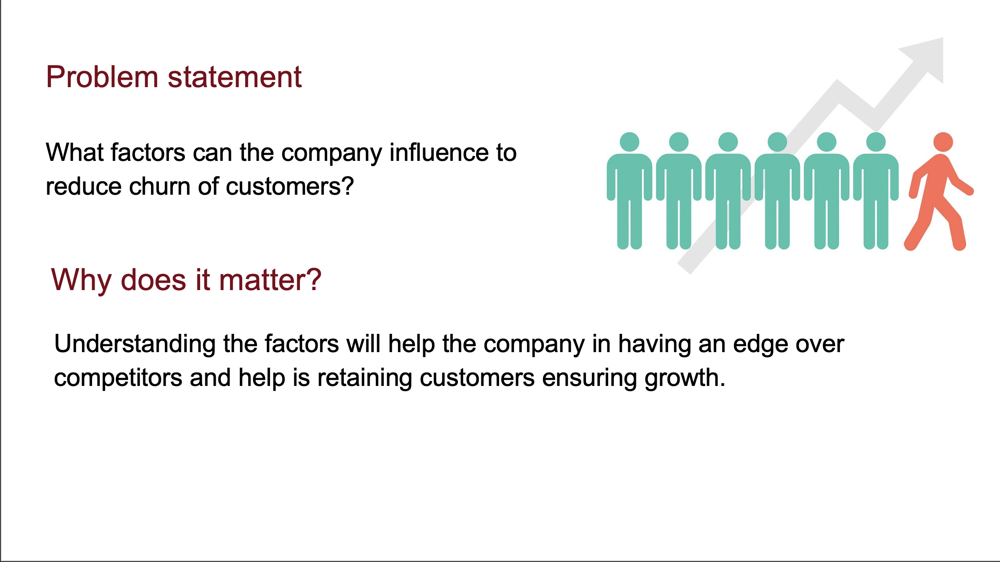
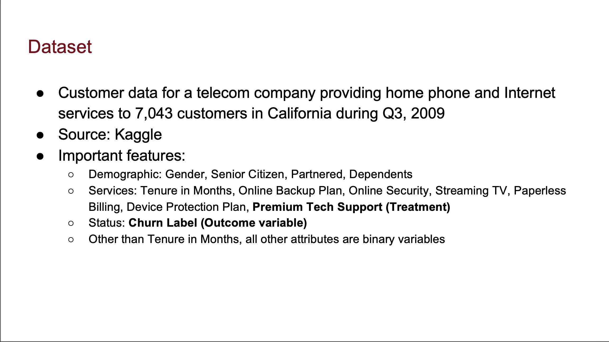
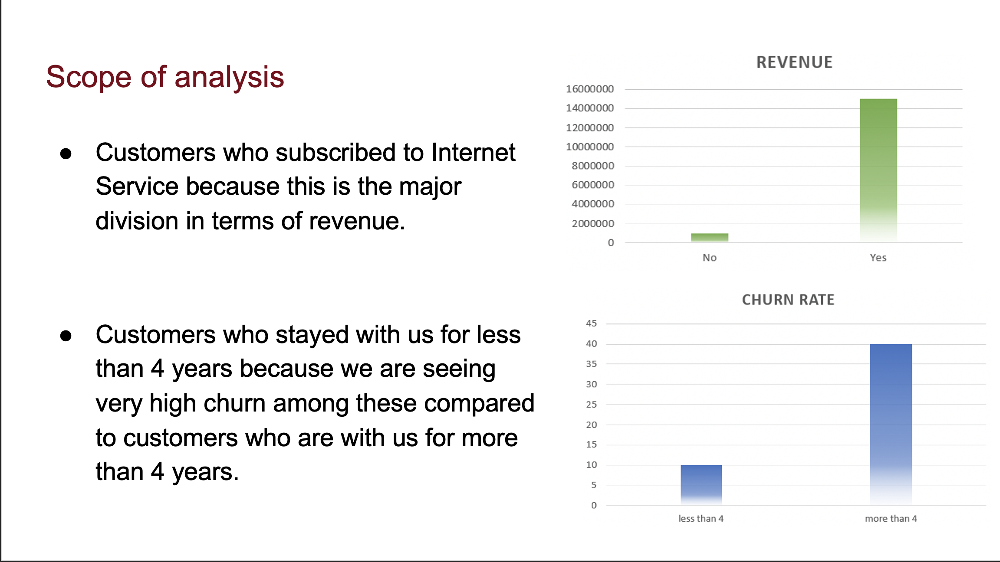
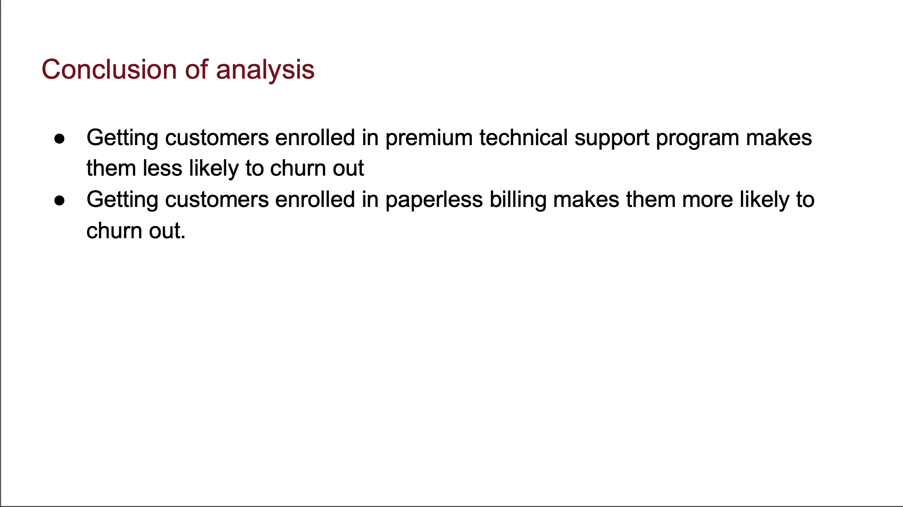
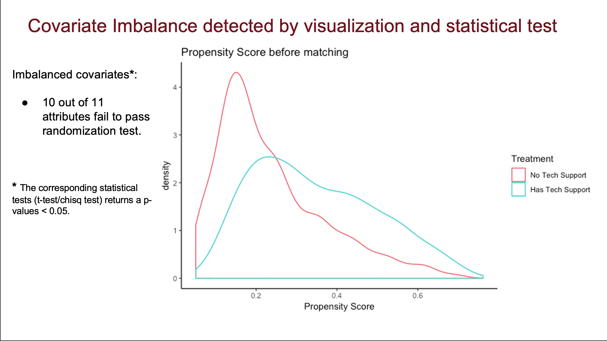

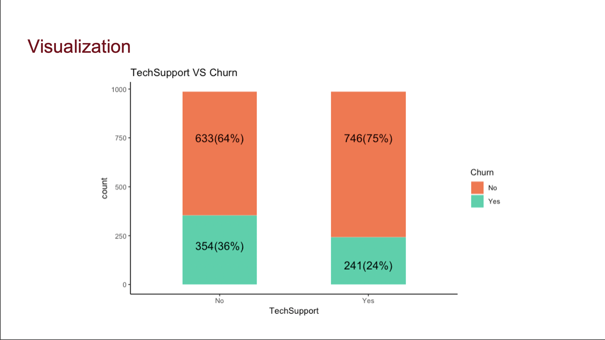
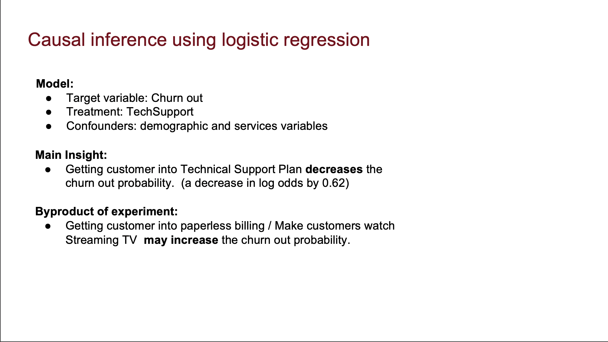
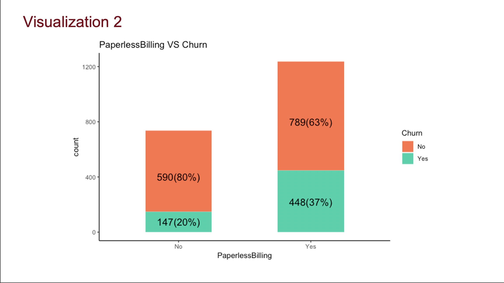
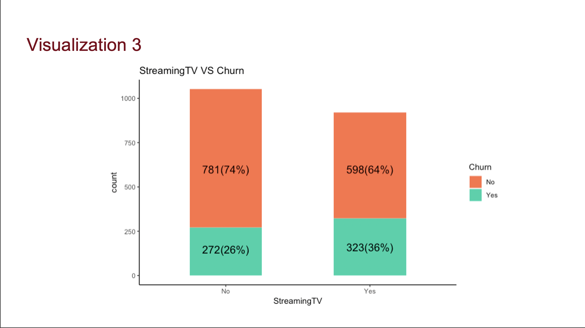
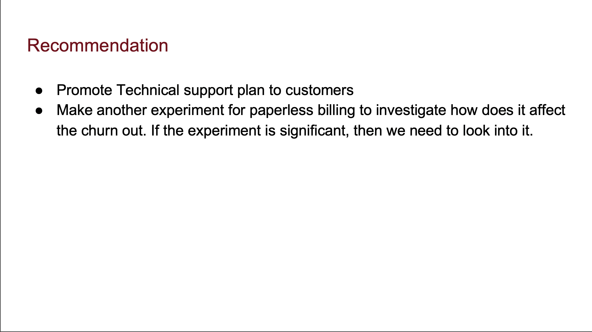
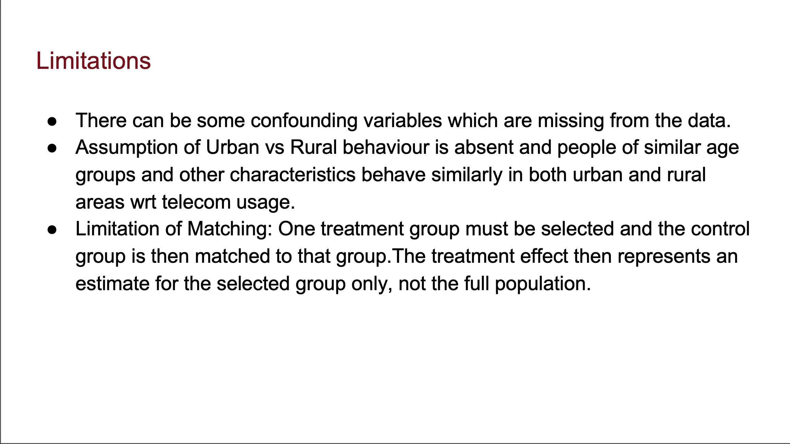

